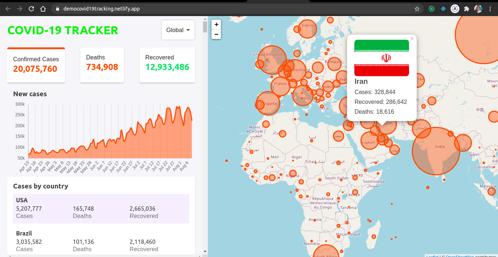

## :earth_africa: :bug: CORONA VIRUS TRACKER :bug: :earth_africa:

The whole world is facing a very difficult time at the moment in the battle against Corona Virus. This little app is built in order to provide general statistics related to Covid 19 cases and help people updated with the situation in global and national scales. The Data is retrieved from an external API [disease.sh](https://disease.sh/v3/covid-19).

In this project, I aim to pratice:

- React app development with Redux state management, fetching data from API, using Leaflet
- Practice styling with flex box and Material UI
- Practice disciplined git usage like proper commits & branching

## :computer: App Demo

Click [HERE](https://democovid19tracking.netlify.app) to check out the MVP demo.  

## :clipboard: Technology Used

- [React](https://github.com/hanhngooo/Covid19-Tracker/blob/master/src/App.js)
- [Redux](https://github.com/hanhngooo/Covid19-Tracker/tree/master/src/store)
- [Material UI](https://github.com/hanhngooo/Covid19-Tracker/blob/master/src/App.js)
- [React-Leaflet](https://github.com/hanhngooo/Covid19-Tracker/blob/master/src/components/Map/Map.js)

## :man: User stories :girl:

- As a user, I want to see stats for positive cases, deaths and recovered cases
  - Three boxes display these stats
- As a user, I want to know the new cases number each day
  - A line chart displays new cases/ deaths / recovered
- As a user I want to see stats from all the countries so I can have a comparison
  - A table displays all stats from all countries in descending order
- As a user, I want to see stats from countries shown on a map
  - A map with circle points demonstrates the infected countries
  - A pop up shows stats of each country when clicking on circles
- As a user, I want to see stat from specific chosen country
  - A Button with list of countries. Only the stats of a chosen country is shown on Boxes and Line Chart and Map is centered to that country

## :hammer: How this app was built

- [Dropdown Button](https://github.com/hanhngooo/Covid19-Tracker/tree/countries-dropdown)
- [Info Boxes](https://github.com/hanhngooo/Covid19-Tracker/tree/inforBox)
- [Info Table](https://github.com/hanhngooo/Covid19-Tracker/tree/countries-table)
- [Line Chart](https://github.com/hanhngooo/Covid19-Tracker/tree/chart-feature)
- [Map](https://github.com/hanhngooo/Covid19-Tracker/tree/map)
- [Map Info](https://github.com/hanhngooo/Covid19-Tracker/tree/map-info)

## :floppy_disk: How to Install this?

- Clone the app
- cd into your project
- Install dependencies using `npm install`
- Start development server using `npm run start`
